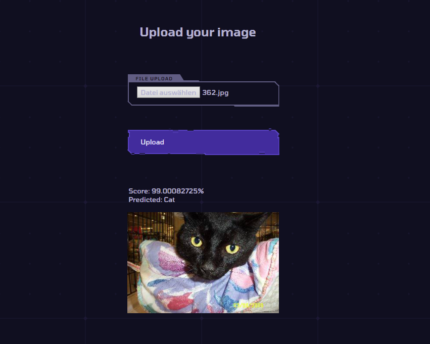
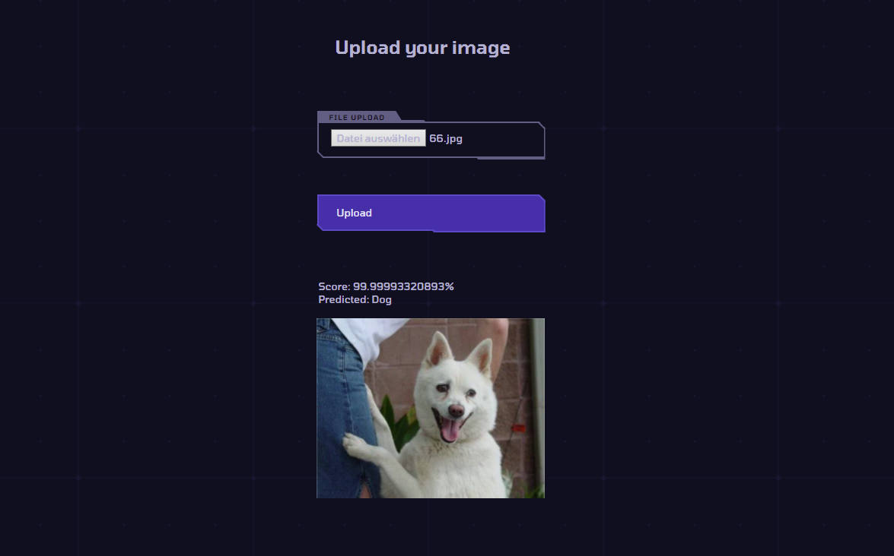

# Katz0rz (unfinished)

*Could not figure out how to use your own trained model.*

It is just a ASP.NET Core Application to use pretrained Tensorflow Models to predict Images. At the time it is the Inception Model.
Right now it is configured to run locally.

- Using:
  - https://github.com/dotnet/samples/blob/master/machine-learning/tutorials/TransferLearningTF/image-classifier-assets.zip
  - https://storage.googleapis.com/download.tensorflow.org/models/inception5h.zip

- For Linux:
1. Be sure that your CPU supports FMA and AVX/AVX2
2. Comment out the lines of code in Katz0rz.csproj and Controller/HomeController.cs
3. Install "libgdiplus"
    - ```Arch Linux > yay -S libgdiplus```
    - ```Ubuntu / Debian > sudo apt install libgdiplus```

- Building the project on Linux:
```
> dotnet restore
> dotnet build
> dotnet run
```
- - -

## Cat Recognition



## Dog Recognition


